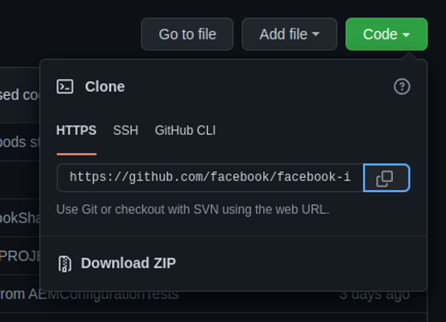

# Repositórios

Repositórios são diretórios, que também podemos chamar de pastas. Para o sistema, eles são divisões lógicas onde podemos alocar nossos arquivos com a estrutura de pastas de forma organizada.

Quando criamos um repositório no GIT ou no GITHUB, estamos criando um espaço reservado para que o projeto seja armazenado.

Você pode obter um repositório GIT de duas formas: Criar um diretório local e transformá-lo em um repositório GIT, ou fazer um clone (copiar) de um repositório GIT existente em outro lugar, de outra pessoa e utilizá-lo.

Iniciando repositório em diretório local

Se você quiser iniciar a partir de um diretório local, você deve primeiro criar o diretório:

Abra o terminal e entre na pasta do seu computador, onde deseja armazenar esse diretório:

`cd /Documentos` (no meu caso, vou armazenar na pasta Documentos)

`mkdir meu_repositorio` para criar a pasta onde serão inseridos os arquivos do projeto

`cd /meu_repositorio` para entrar na pasta que acabamos de criar

Dentro da pasta, execute: `git init`

Quando executamos esse comando, um novo subdiretório chamado .git é criado, onde serão armazenados os arquivos necessários do repositório com as informações de log. Nesse momento tempos a estrutura criada e já podemos começar a gerenciar os arquivos do projeto.

Iniciando repositório a partir de um Clone de repositório existente

No GITHUB você vai encontrar inúmeros repositórios públicos que você pode clonar e utilizar o projeto para fins de estudos ou para contribuir com alguma feature para o autor. Esse recurso é muito utilizado quando é necessário copiar o projeto para outro membro do time ou para colaboração entre times diferentes.

Primeiro, no seu terminal, entre na pasta onde deseja copiar o repositório: `cd Documentos`

Então, dentro do github, você precisa encontrar o repositório que deseja clonar, e clique no botão Code, como mostrado na imagem abaixo:

Isso vai abrir a seguinte janela:

Copie o endereço do repositório e execute: `git clone UrlDoRepositorio` após executar esse comando, o repositório será copiado para o seu computador.

Finalizando essa operação, o projeto já estará preparado para ser utilizado.
